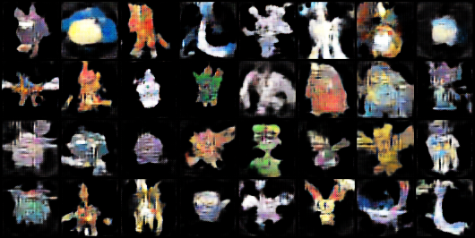

# Pokemon GAN

    
     
    <i>Fake Pokemon created by the Pokemon GAN</i>

## About
This project is a Wasserstein Generative Adversarial Network with Gradient Penalty (WGAN-GP) which is able to generate images of Pokemon which do not actually exist. The network was trained on 721 images of real Pokemon from <a href="https://www.kaggle.com/datasets/vishalsubbiah/pokemon-images-and-types">this</a> online dataset. 

This project was inspired by the *pokeGAN* and subsequent <a href="https://www.youtube.com/watch?v=yz6dNf7X7SA&t">Youtube video</a> created by Siraj Raval.

## Dependencies
- pytorch
- torchvision
- tqdm
- numpy
- matplotlib